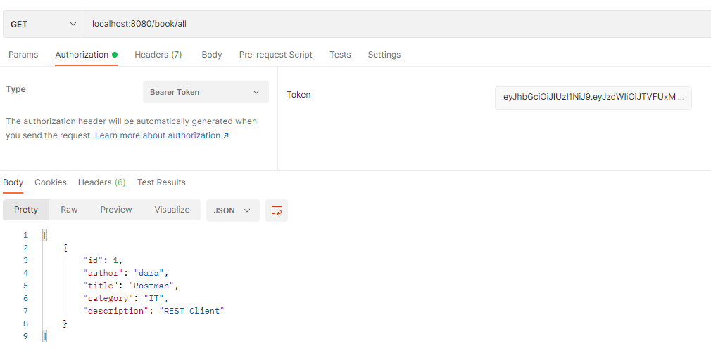

# Book Management Microservice 
This Book Management project demonstrates using microservices architecture, separate authentication service and service discovery.

# Architecture

# Services
* **gateway-server**: a module that Spring Cloud Gateway for running Spring Boot application that acts as a proxy/gateway in our architecture.
* **eureka-server**: a module that depending on the example it uses Spring Cloud Netflix Eureka as an embedded discovery server.
* **auth-service**: JWT authentication service
* **book-service**: service with sensitive data
* **student-service**: service with sensitive data

# Running Project

### Requirements
- Java 11
- Docker
- MSSQL Server
- SQL Server Management Studio

### Pre installation

#### Setup MSSQL server

```shell
docker run -e 'ACCEPT_EULA=Y' \
 -e 'SA_PASSWORD=1qazXSW@' \
 -p 1433:1433 \
 --restart=unless-stopped \
 -v mssql-data:/var/opt/mssql/data \
 -d mcr.microsoft.com/mssql/server:2017-CU8-ubuntu
 ```
#### Create Database
Connect to SQL Server instance and right-click on the databases folder. Click on new database and the following screen will appear.
Create following database below:
- auth
- student
- book


### Run project manually

**eureka-server**
```shell
$ cd eureka-server/
$ ./mvnw clean spring-boot:run
```

**student-service**
```shell
$ cd student-service/
$ ./mvnw clean spring-boot:run
```

**book-service**
```shell
$ cd book-service/
$ ./mvnw clean spring-boot:run
```

**auth-service**
```shell
$ cd auth-service/
$ ./mvnw clean spring-boot:run
```

**gateway-service**
```shell
$ cd gateway-service/
$ ./mvnw clean spring-boot:run
```
|     Service     | Port |
|:---------------:|:----:|
| eureka-server  | 8081 |
| gateway-server  | 8081 |
| student-service | 8082 |
|  auth-service   | 8083 |
|  book-service   | 8081 |

### Run project with docker compose

**Build project**
```shell
$ docker-compose build 
```


**Up services**
```shell
$ docker-compose up -d
```
The `-d` options runs the docker application in the background as a daemon. This will leave the application running until you decide to stop it.


**Stop and remove containers, networks**
```shell
 $ docker compose down
```
# Testing Rest APIs

**Gateway URL** : `http://localhost:8080`

**Swagger UI**: `http://localhost:8080/swagger-ui.html`
### Auth Service

**Description** : Register

**URL** : `/auth/register`

**Method** : `POST`

**Auth required** : NO

&nbsp;

Request Body

```json
{
  "studentId": "STU100100",
  "password": "the-password",
  "name": "name",
  "portraitPhotoUrl" : "https://entballarat.com.au/wp-content/uploads/2018/11/blank-male.jpg",
  "phoneNumber": "85501299999",
  "email": "jonh.ny@lschool.com"
}
```

### Success Response

**Condition** : Valid parameters

**Code** : `200 OK`

**Content example**

```json
{
  "studentId": "STU100100"
}
```

&nbsp;

**Description** : Login

**URL** : `/login`

**Method** : `POST`

**Auth required** : NO

Request Body

```json
{
  "studentId": "STU100100",
  "password": "the-password"
}
```
&nbsp;
### Success Response

**Condition** : Valid parameters

**Code** : `200 OK`

**Content example**
```json
{
  "id": 4,
  "studentId": "STU100100",
  "token": "eyJhbGciOiJIUzI1NiJ9....."
}
```
&nbsp;

**Description** : Get all books

**URL** : `/book/all`

**Method** : `GET`

**Auth required** : YES


